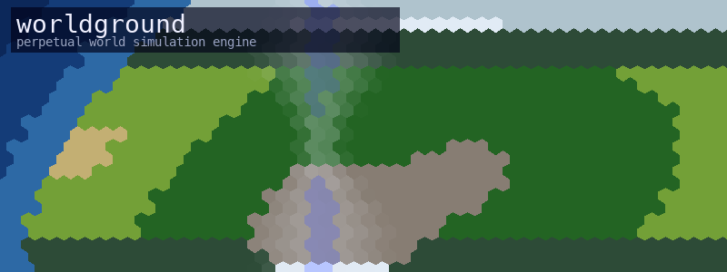

<p align="center">
  
</p>

<h1 align="center">worldground</h1>

<p align="center">
  <strong>A perpetual world simulation engine with scriptable terrain evolution rules</strong>
</p>

<p align="center">
  Generate a hex-tile world — oceans, mountains, forests, deserts — then watch weather, seasons, and ecological change unfold forever. Mod the physics by editing <a href="https://rhai.rs">Rhai</a> scripts. No recompile needed.
</p>

---

Worldground is a sandbox for emergent environmental systems. It's useful if you want to prototype world simulation for a game, explore how feedback loops create weather patterns and biome shifts, or just watch a planet evolve on your second monitor.

## What happens when you run it

1. **Generate** a world: procedural elevation, latitude-based climate zones, biome assignment, resource scattering — all from a seed.
2. **Simulate** it: every tick, 10 Rhai rules execute in 4 phases (Weather → Conditions → Terrain → Resources). Humidity evaporates from oceans, winds carry it inland, clouds form, rain falls, snow accumulates, biomes shift.
3. **Watch** it: open the viewer in a browser. Pan, zoom, switch overlays, click any tile for full details.

Worlds are deterministic given the same seed. Snapshots auto-save so you can stop and resume anytime.

## Quick start

### Prerequisites

You need **Rust** (1.70+) and **Python 3** (any 3.7+, just for serving the viewer).

```sh
# Install Rust — macOS / Linux
curl --proto '=https' --tlsv1.2 -sSf https://sh.rustup.rs | sh
# Windows: download and run https://win.rustup.rs

# Python 3 is pre-installed on macOS.
# Linux: sudo apt install python3 (Debian/Ubuntu) or sudo dnf install python3 (Fedora)
# Windows: https://www.python.org/downloads/ or winget install Python.Python.3
```

### Build, generate, and run

```sh
git clone https://github.com/brookstalley/worldground.git && cd worldground

# Build in release mode (recommended for worlds over 1K tiles)
cargo build --release

# Generate a world
cargo run --release -- generate

# Start the simulation server (terminal 1)
cargo run --release -- run
```

Then in a **second terminal**, serve the viewer:

```sh
cd viewer && python3 -m http.server 8081
```

Open **http://localhost:8081**. The viewer auto-connects to the simulation on WebSocket port 8080.

At ~1 tick/second for 16K tiles, you'll see weather patterns form and sweep across the world in real time. Drop to 1K tiles (`tile_count = 1000` in `worldgen.toml`) for 8+ ticks/second.

## How it works

### The world

Each hex tile has immutable layers set at generation time and mutable layers that evolve every tick:

| Layer | What it tracks | Mutable? |
|-------|---------------|----------|
| **Geology** | Terrain type, elevation, soil, drainage | No |
| **Climate** | Zone, base temperature, latitude | No |
| **Weather** | Temperature, humidity, wind, clouds, precipitation, storms | Yes |
| **Conditions** | Soil moisture, snow depth, mud, flooding, fire risk | Yes |
| **Biome** | Type, vegetation density/health, transition pressure | Yes |
| **Resources** | Quantities with renewal rates | Yes |

### The simulation

Each tick runs 4 phases in order. Within a phase, all tiles read from a snapshot of the previous state (double-buffered), so evaluation order doesn't matter and tiles can be evaluated in parallel.

```
Weather       →  Conditions    →  Terrain       →  Resources
wind, temp,      soil moisture,   biome shifts,    renewal,
humidity,        snow/mud/flood,  vegetation,      consumption
clouds, rain,    frost, drought,  transition
storms           fire risk        pressure
```

Rules are Rhai scripts in `rules/<phase>/`, executed in filename order. A rule reads tile and neighbor state, then calls `set("field", value)` to propose mutations.

Biome transitions are constrained to an adjacency graph — Tundra can become Ice or Boreal Forest, but not Desert. This prevents jarring jumps and creates realistic ecological gradients.

### Seasons

Spring → Summer → Autumn → Winter, cycling forever. Season length is configurable (default: 90 ticks per season = 360 ticks per year). Temperature curves, precipitation patterns, and biome pressures all respond to the current season.

### Parallelism

Tile evaluation runs in parallel using [rayon](https://docs.rs/rayon). On a 10-core machine this gives ~3x speedup at large tile counts. The bottleneck is Rhai script interpretation (~1ms per tile across all 4 phases).

## Configuration

**`worldgen.toml`** — controls world generation:

```toml
seed = 0              # 0 = random, any other value = deterministic
tile_count = 16000    # hex tiles (minimum 100)
ocean_ratio = 0.6     # fraction of world that is water
mountain_ratio = 0.1  # fraction of land that is mountainous
climate_bands = true  # latitude-based climate zones
resource_density = 0.3
```

**`config.toml`** — controls the simulation runtime:

```toml
tick_rate_hz = 1.0        # target ticks per second
season_length = 90        # ticks per season
snapshot_interval = 100   # ticks between auto-saves
rule_timeout_ms = 10      # per-tile rule execution limit (ms)
websocket_port = 8080
```

## Writing rules

Rules are Rhai scripts. Each receives the current tile (`tile`), its neighbors (`neighbors`), the `season`, and the `tick` count. Call `set()` to propose field mutations.

```js
// Example: temperature from climate base, adjusted for altitude and season
let base_temp = tile.climate.base_temperature;
let lapse = tile.geology.elevation * 20.0;
let season_offset = if season == "Summer" { 12.0 }
                    else if season == "Winter" { -12.0 }
                    else { 0.0 };
set("temperature", base_temp - lapse + season_offset);
```

Neighbor reads enable spatial effects like moisture transport:

```js
// Example: blend humidity with neighbors (wind-driven advection)
let sum = 0.0;
for n in neighbors {
    sum += n.weather.humidity;
}
set("humidity", tile.weather.humidity * 0.7 + (sum / neighbors.len()) * 0.3);
```

Rules in the same phase see the pre-phase snapshot, not each other's mutations. Rules across phases see the cumulative result of prior phases. See `rules/` for the full set of 10 production rules.

## Viewer overlays

| Overlay | What you see |
|---------|-------------|
| Biome | Ecological zones in distinct colors |
| Terrain | Geological terrain types |
| Temperature | Blue (cold) → red (hot) gradient |
| Humidity | Brown (dry) → blue (wet) gradient |
| Precipitation | Intensity and type (rain/snow/sleet) |
| Cloud cover | Clear → overcast gradient |
| Wind speed | Calm → strong, with directional arrows when zoomed in |
| Vegetation | Bare → lush gradient |
| Elevation | Low → high gradient |

## CLI reference

```
worldground generate [--worldgen FILE] [--output DIR]
worldground run [--world PATH] [--tick-rate HZ] [--port PORT]
worldground inspect --tile ID
worldground inspect --world
worldground snapshots list
worldground snapshots restore FILE
```

## Performance

Measured on an M-series Mac (10 cores), release build:

| Tiles | Ticks/sec | Feel |
|-------|-----------|------|
| 1,024 | ~8.5 | Smooth real-time |
| 4,096 | ~3.3 | Comfortable |
| 16,256 | ~1.0 | Watchable, weather moves visibly |

## Project structure

```
worldground/
├── src/
│   ├── cli/          # Command implementations
│   ├── config/       # TOML config parsing
│   ├── persistence/  # Snapshot save/load (bincode)
│   ├── server/       # WebSocket server + HTTP health endpoint
│   ├── simulation/   # Tick engine, phase execution, statistics
│   └── world/        # Tile structures, procedural generation, topology
├── rules/
│   ├── weather/      # 4 rules: wind/temp, humidity, clouds, storms
│   ├── conditions/   # 2 rules: soil moisture, snow/mud
│   ├── terrain/      # 3 rules: biome pressure, vegetation, transitions
│   └── resources/    # 1 rule: regeneration
├── viewer/
│   └── index.html    # Single-file browser viewer
├── snapshots/        # Auto-saved world state (bincode)
├── config.toml       # Simulation settings
└── worldgen.toml     # Generation parameters
```

## Status

Worldground is an active experiment. The weather system produces recognizable patterns (ocean moisture gradients, mountain rain shadows, seasonal cycles, storm formation), but there's plenty of room to add more interesting dynamics. Contributions and ideas welcome.

## License

MIT
